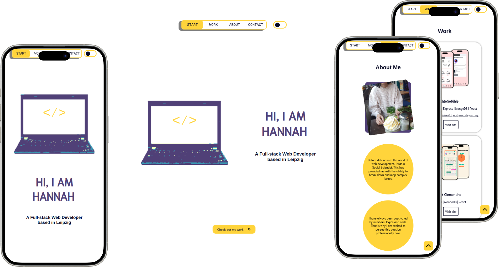
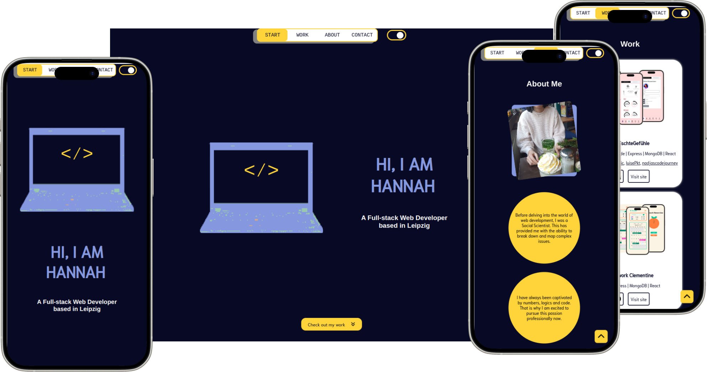

# Portfolio

This fully responsive single-page portfolio application was built with React and Vite and uses CSS Modules for styling.

## Preview

The portfolio website comes with a dark and light mode:




## Explore the Website

Take a look at the deployed website here: [https://hannahnier.onrender.com/](https://hannahnier.onrender.com/)

## Installation and Running Locally

If you want to run the project locally, please follow these steps:

1. **Clone the repository and navigate to the project directory:**
   ```bash
   git clone git@github.com:hannahnier/portfolio.git
   cd portfolio
   ```
2. **Install dependencies and start the development server:**
   ```bash
   npm install
   npm run dev
   ```
   The portfolio should then be locally accessible at `http://localhost:3000`.

## Tech Stack

- **React**
- **Vite**
- **CSS Modules**
- **Nodemailer**
